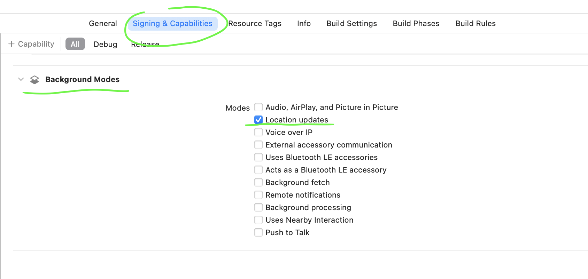

# CalmGeo

> iOS 17 導入した `CLLocationUpdate.liveUpdates()` を利用して、バックグランドで位置情報取得用ライブラリー

> ## ※ target は iOS 14 以降にしているが、機能自体 iOS 17 以降しか動作しない。

> ■ 特別な感謝

- https://medium.com/simform-engineering/streamlined-location-updates-with-cllocationupdate-in-swift-wwdc23-2200ef71f845
- https://github.com/transistorsoft/react-native-background-geolocation

> ■ ストレージは、下記を利用している

- MMKV: https://github.com/Tencent/MMKV

## 1. 主な特性

- バックグランドで位置情報を取得する
- iOS17 の新機能利用し、バッテリーの消費量大きく抑える
- 静止後位置情報サービスを自動停止する
- 速度より取得頻度の補正できる
- 自動的にサーバーと同期できる

## 2. 導入

> ※ 本ライブラリーは、下記に配信している

- [CocoaPods](https://cocoapods.org)

> 下記内容を `Podfile` に追加すると導入できる

```ruby
pod 'CalmGeo'
```

## 3. バックグランドの位置情報の取得に

### 3.1 アプリプロジェクトで、下記の設定が必要となる



### 3.2 `Info.plist` に、下記の項目を追加する必要

■ 例

```xml
<key>NSLocationAlwaysAndWhenInUseUsageDescription</key>
<string>need always</string>
<key>NSLocationWhenInUseUsageDescription</key>
<string>need it</string>
```

## 4. 各種設定

### 4.1 下記 I/F で設定の調整をできる

- `startCalmGeo(key: String, config: CalmGeoConfigType?) -> CalmGeoServiceType?`
- `createCalmGeo(key: String, config: CalmGeoConfigType?) -> CalmGeoServiceType?`
- `CalmGeoServiceType::restart(config: CalmGeoConfigType)`

### 4.2 設定用データ仕様: `CalmGeoConfigType`

| 項目                   | 型      | 説明                                     | default                                |
| ---------------------- | ------- | ---------------------------------------- | -------------------------------------- |
| desiredAccuracy        | Double  | 位置情報取得精度                         | `CalmGeoDesiredAccuracy.best.rawValue` |
| distanceFilter         | Int     | 記録最小移動距離(m)                      | `16`                                   |
| disableSpeedMultiplier | Bool    | 速度補正の無効化                         | `false`                                |
| speedMultiplier        | Double  | 速度補正係数                             | `3.1`                                  |
| stationaryRadius       | Double  | 停止後計測再開のトリガー移動距離(m)      | `25.0`                                 |
| url                    | String? | 位置情報アップロード URL                 | `nil`                                  |
| token                  | String? | アップロード用トークン                   | `nil`                                  |
| httpTimeout            | Int     | アップロード処理時の接続タイムアウト(ms) | `10000`                                |
| method                 | String  | アップロードメソード                     | `POST`                                 |
| autoSync               | Bool    | 自動アップロード                         | `false`                                |
| syncThreshold          | Int     | 自動アップロードパッケージサイズ         | `12`                                   |
| maxBatchSize           | Int     | 1 回アップロード処理の最大位置情報記録数 | `250`                                  |
| maxDaysToPersist       | UInt32  | ローカルで位置情報保存の最大時間(day)    | `7`                                    |

### 4.3 精度 enum: `CalmGeoDesiredAccuracy`<br/>

| 値                   | 説明: [CLLocationAccuracy](https://developer.apple.com/documentation/corelocation/cllocationaccuracy) |
| -------------------- | ----------------------------------------------------------------------------------------------------- |
| `.bestForNavigation` | `kCLLocationAccuracyBestForNavigation`                                                                |
| `.best`              | `kCLLocationAccuracyBest`                                                                             |
| `.tenMeters`         | `kCLLocationAccuracyNearestTenMeters`                                                                 |
| `.hundredMeters`     | `kCLLocationAccuracyHundredMeters`                                                                    |
| `.kilometer`         | `kCLLocationAccuracyKilometer`                                                                        |
| `.threeKilometer`    | `kCLLocationAccuracyThreeKilometers`                                                                  |

## 5. I/F 仕様

### 5.1 `CalmGeoServiceType` の I/F 仕様

| I/F                                                                      | 説明                                                       |
| ------------------------------------------------------------------------ | ---------------------------------------------------------- |
| start()                                                                  | 計測開始                                                   |
| stop()                                                                   | 計測停止                                                   |
| restart(config: `CalmGeoConfigType`)                                     | 新しい設定で計測再起動                                     |
| clearAllLocations()                                                      | ローカルストレージをクリアする                             |
| getGeoData() -> CalmGeoLocation?                                         | 現在地の位置情報を取得する（副作用：取得結果の保存も行う） |
| getStoredLocations() -> [`CalmGeoLocation`]                              | ローカル保存している位置情報を取得する                     |
| getStoredCount() -> Int                                                  | ローカル保存している位置情報数を取得する                   |
| sync()                                                                   | （サーバー同期設定有効の場合）強制的にサーバーと同期する   |
| registerLocationListener(\_ listener: @escaping CalmGeoLocationListener) | 位置情報更新イベントハンドラーを登録する                   |
| unregisterLocationListener()                                             | 位置情報更新イベントハンドラー解除                         |
| getSyncState() -> `CalmGeoSyncState?`                                    | サーバー同期状態の取得                                     |
| state: `CalmGeoServiceState`                                             | 計測状態の取得                                             |

### 5.2 `CalmGeoLocation` データ仕様

| 項目      | 型              | 説明                         |
| --------- | --------------- | ---------------------------- |
| id        | String          | データ ID                    |
| timestamp | String          | 記録時刻（ISO8601、ms まで） |
| isMoving  | Bool            | 移動中かどうか               |
| coords    | `CalmGeoCoords` | 位置情報                     |
| event     | Event?          | イベント：`motionchange`     |

### 5.3 `CalmGeoCoords`　データ仕様

| 項目                | 型      | 説明                             |
| ------------------- | ------- | -------------------------------- |
| latitude            | Double  | 緯度（deg）                      |
| longitude           | Double  | 軽度（deg）　                    |
| accuracy            | Double  | 精度（m）                        |
| speed               | Double  | 速度（m/s）                      |
| speedAccuracy       | Double  | 速度精度（m/s）                  |
| heading             | Double  | 向き（北：0.0、時計回り、deg）   |
| headingAccuracy     | Double  | 向き精度（deg）                  |
| altitude            | Double  | 高度（m）                        |
| altitudeAccuracy    | Double  | 高度精度（m）                    |
| ellipsoidalAltitude | Double  | 準拠楕円体から高さ（m）          |
| floor               | Double? | 階数                             |
| mock                | Bool?   | モックかどうか                   |
| external            | Bool?   | アクセサリーから取得したかどうか |

### 5.4 `CalmGeoSyncState`　データ仕様

| 項目      | 型           | 説明                   |
| --------- | ------------ | ---------------------- |
| timestamp | Date         | 前回同期処理時刻       |
| tried     | Int          | リトライ回数           |
| wait      | TimeInterval | リトライ待機時間 （s） |

### 5.5 `CalmGeoServiceState` データ仕様 （Enum）

| 項目     | 説明   |
| -------- | ------ |
| .running | 計測中 |
| .stopped | 停止中 |

## 6. ライブラリの内部仕様

- 停止状態で 1 分間経過すると、溜まった位置情報をアップロードする。（サーバー同期設定有効時）
- 停止状態で 2 分間経過すると、待機状態へ遷移する。（`stationaryRadius`以上の移動距離発生すると計測再開する）
- サーバー同期済みの位置情報をローカルから削除する。
- サーバー同期失敗の場合、自動リトライを行う。（繰り返し失敗の場合、最大 10 分間待ってからリトライする）

## 7. サンプル

> ※ [Example](./Example/) にサンプルアプリある。（ビルドには先に下記を実行してください）<br/>

```bash
cd Example
pod install
```

### 7.1 ラッパーを作る

```swift
// GeoService.swift
import CalmGeo

public class GeoService {
  init(config: CalmGeoConfigType?) {
    self._geoService = createCalmGeo(config: config)
  }

  public var isRunning: Bool {
    return _geoService?.state == .running
  }

  public func listenToLocation(_ listener: @escaping CalmGeoLocationListener) {
    _geoService?.registerLocationListener { location in
      listener(location)
    }
  }

  public func start() {
    Logger.standard.info("Start: GeoService")
    _geoService?.start()
  }

  private var _geoService: CalmGeoServiceType?
}
```

### 7.2 アプリでシングルトンを作成する

```swift
// GeoAssembly.swift
import CalmGeo
import Foundation

final class GeoAssembly {
  static var config: CalmGeoConfigType {
    var config = CalmGeoConfig.standard
    return config
  }
  // app singleton
  static var geo = GeoService(config: config)

  func build() -> any GeoServiceType {
    return GeoAssembly.geo
  }
}
```

### 7.3 計測を開始する

```swift
// LocationModel.swift
import CalmGeo
import SwiftUI

class LocationModel: ObservableObject {
  private var service: any GeoServiceType

  @Published var currentLocation: CalmGeoLocation?

  init(service: any GeoServiceType) {
    self.service = service

    self.service.listenToLocation { [weak self] location in
      DispatchQueue.main.async {
        self?.currentLocation = location
      }
    }

    self.service.start()
  }
}
```

### 7.4 App で `environmentObject` を初期化して、各種 View で利用できるようにする

```swift
// App.swift
import SwiftUI

@main
struct RootApp: App {
  var body: some Scene {
    WindowGroup {
      RootView().environmentObject(
        LocationModel(service: GeoAssembly().build()))
    }
  }
}
```

## 8. サポート

t2, t2tx@icloud.com

## 9. ライセンス

CalmGeo is available under the MIT license. See the LICENSE file for more info.
